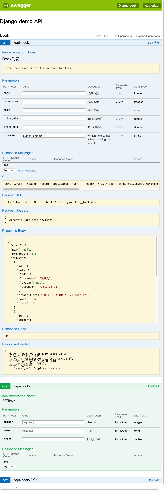

# Django demo

* Django、Restframework、Swagger
* Docker、docker-compose、uwsgi、mysql

#### Usage:
1. `docker build -t django_demo:dev ./`
2. `docker-compose up -d`
3. Admin account and password: admin/qwerasdf
4. API doc url http://127.0.0.1:8000/api/doc/, sample as follow.
5. Swagger authorize: add token in admin, then input token like `Token 1c7de930611fcc0f047a26922fea8f63f462c01b`

